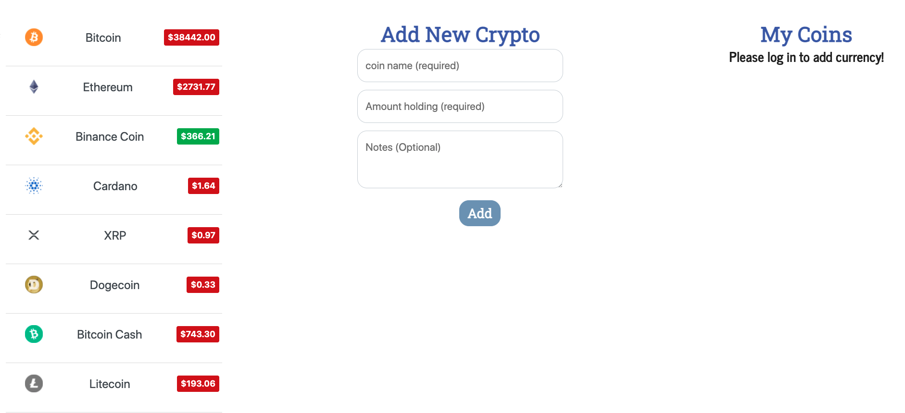

# cryptography

  
  # Description
  
  Cryptography is a React app that allows users to have a one-stop-shop to keep up with the quickly-evolving world of cryptocurrency! This app allows for users to input and update your current coin holdings, as well as multiple API's that allow you to see the current coin market prices and data to help you make informed decisions. A news feed at the top provides the latest Crypto headlines to let you know what's going on right "now" in the world of crypto.
 

  # Table of Contents 
  * [Installation](#installation)
  * [Usage](#usage)
  * [License](#license)
  * [Contributing](#contributing)
  * [Credits](#questions)
  
  # Installation
 
 You simply create an account with out Sign Up option. Go back to the Main Page and start adding Coins!

You could aslo:

  -Clone this Repo to your Terminal.
  -Run 'npm install' for any dependecies.
  -Run 'npm start' and it will guice your to a localhost

  # License
  This project is license under the Microsoft Public License license.
  
  # Contributing
  
  ​Contributors:

  Michael  Kahn: https://github.com/mpkahn

  Omar Dahmash: https://github.com/omartdh

  Miguel Alcantar: https://github.com/malcan09

  # Credits
  * MongoDB & Mongo Atlas & Robo3T
  * React & CRA
  * Free news API https://newsapi.org/
  * Coingecko API https://www.coingecko.com/en

 

  